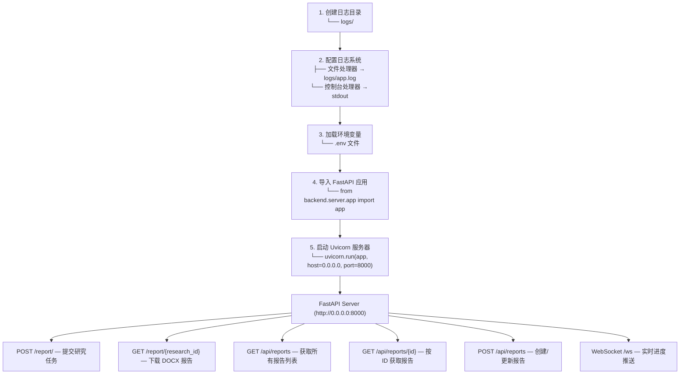
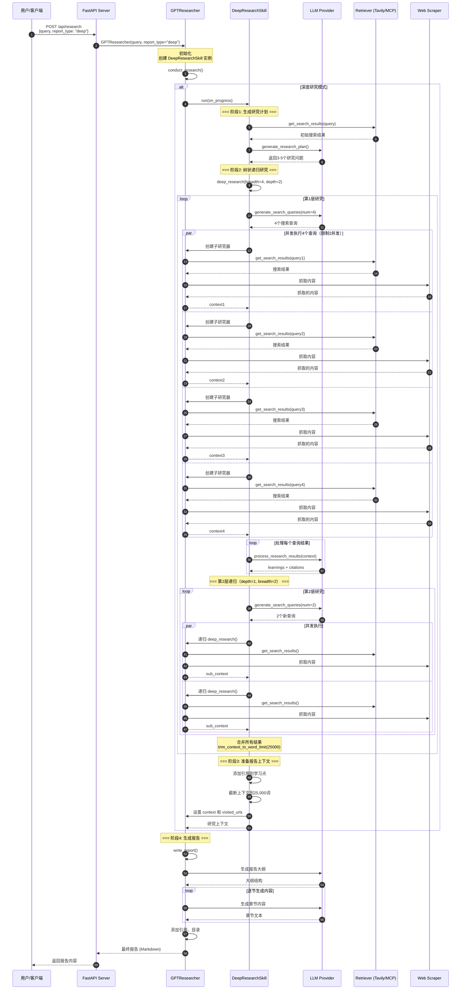

# GPT-Researcher 深度研究功能分析

**文档版本：** 1.0
**分析日期：** 2026-02-27
**项目版本：** 0.14.6
**分析目标：** 深度剖析 GPT-Researcher 项目架构与深度研究功能实现

---

## 目录

1. [项目概述](#一项目概述)
2. [项目目录结构](#二项目目录结构)
3. [后端架构分析](#三后端架构分析)
4. [深度研究功能详解](#四深度研究功能详解)
5. [核心流程时序图](#五核心流程时序图)
6. [技术要点总结](#六技术要点总结)
7. [附录](#七附录)

---

## 一、项目概述

### 1.1 项目简介

**GPT Researcher** 是一个开源的深度研究智能体，专为网络和本地文档的自动化研究而设计。它采用"计划-执行"架构，通过多个智能体协作生成详细、客观、带引用的研究报告。

### 1.2 核心特性

| 特性              | 说明                                                       |
| ----------------- | ---------------------------------------------------------- |
| 🌳 **深度研究**   | 树状递归探索，支持自定义深度和广度                         |
| 🔄 **多智能体**   | Planner（规划）、Researcher（研究）、Publisher（发布）协作 |
| 🔍 **多数据源**   | Web搜索（Tavily/DDG）、MCP、本地文档                       |
| ⚡ **并发处理**   | 异步执行，支持并发控制                                     |
| 📝 **多格式输出** | Markdown、PDF、Word、HTML                                  |
| 🤖 **多LLM支持**  | OpenAI、Ollama、LiteLLM等                                  |

### 1.3 技术栈

```yaml
核心框架:
  - FastAPI: 0.104.1+ # Web服务框架
  - LangChain: 1.0.0+ # LLM应用框架
  - LangGraph: 0.2.73+ # 多智能体编排
  - asyncio: 异步编程支持

LLM提供商:
  - OpenAI: 1.3.3+ # GPT模型
  - Ollama: 0.4.8+ # 本地模型
  - LiteLLM: 1.71.0+ # 多模型统一接口

搜索与检索:
  - Tavily: 专业搜索API
  - DuckDuckGo: 4.1.1+ # 免费搜索引擎
  - MCP: 1.9.1+ # Model Context Protocol

文档处理:
  - BeautifulSoup: 4.12.2+ # HTML解析
  - PyMuPDF: 1.23.6+ # PDF处理
  - unstructured: 0.13+ # 非结构化文档
```

---

## 二、项目目录结构

### 2.1 整体结构

```
gpt-researcher/
├── gpt_researcher/          # 🔥 核心模块
│   ├── actions/             # 研究动作（搜索、抓取、处理）
│   ├── config/              # 配置管理
│   ├── context/             # 上下文管理
│   ├── document/            # 文档处理
│   ├── llm_provider/        # LLM提供商抽象
│   ├── mcp/                 # MCP集成
│   ├── memory/              # 记忆管理
│   ├── retrievers/          # 检索器（Tavily、DDG等）
│   ├── scraper/             # 网页抓取器
│   ├── skills/              # 🎯 技能模块（深度研究核心）
│   ├── utils/               # 工具函数
│   ├── vector_store/        # 向量存储
│   ├── agent.py             # ⭐ GPTResearcher主类
│   └── prompts.py           # 提示词模板
│
├── backend/                 # FastAPI后端服务
│   ├── server/
│   │   ├── app.py           # FastAPI应用
│   │   ├── server_utils.py  # 服务器工具
│   │   └── websocket_manager.py # WebSocket管理
│   ├── report_type/         # 不同报告类型的处理
│   │   ├── basic_report/
│   │   ├── deep_research/
│   │   └── detailed_report/
│   ├── chat/                # 对话功能
│   ├── memory/              # 记忆管理
│   ├── run_server.py        # 后端启动脚本
│   └── utils.py             # 工具函数
│
├── frontend/                # 前端应用
│   ├── index.html           # 静态HTML入口
│   ├── scripts.js           # 前端脚本
│   ├── styles.css           # 样式表
│   ├── nextjs/              # Next.js生产版本
│   └── static/              # 静态资源
│
├── multi_agents/            # LangGraph多智能体实现
├── multi_agents_ag2/        # AG2多智能体实现
├── mcp-server/              # MCP服务器实现
│
├── main.py                  # 🚀 应用入口
├── cli.py                   # 命令行接口
├── pyproject.toml           # 项目配置
├── requirements.txt         # 依赖列表
└── README.md                # 项目说明
```

### 2.2 核心模块详解

#### 2.2.1 `gpt_researcher/` 核心模块

```
gpt_researcher/
├── __init__.py              # 模块导出
├── agent.py                 # GPTResearcher主类（720行）
├── prompts.py               # 提示词模板（40KB）
│
├── actions/                 # 研究动作
│   ├── __init__.py
│   ├── agent_creator.py     # 智能体创建
│   ├── markdown_processing.py # Markdown处理
│   ├── query_processing.py  # 查询处理和搜索
│   ├── report_generation.py # 报告生成
│   ├── retriever.py         # 检索器调用
│   ├── utils.py             # 工具函数
│   └── web_scraping.py      # 网页抓取
│
├── config/                  # 配置管理
│   ├── __init__.py
│   ├── config.py            # 配置类
│   └── variables/           # 配置变量定义
│       ├── base.py          # 基础配置类型
│       └── default.py       # 默认配置值
│
├── llm_provider/            # LLM提供商
│   ├── __init__.py
│   ├── generic/             # 通用LLM提供商
│   │   ├── __init__.py
│   │   └── base.py          # 基础类和提供商支持
│   └── image/               # 图像生成提供商
│
├── skills/                  # 🎯 技能模块（深度研究核心）
│   ├── __init__.py
│   ├── deep_research.py     # ⭐⭐⭐ 深度研究技能
│   ├── researcher.py        # 标准研究技能
│   ├── writer.py            # 报告生成技能
│   ├── browser.py           # 浏览器管理
│   ├── context_manager.py   # 上下文管理
│   ├── curator.py           # 来源策展
│   └── image_generator.py   # 图像生成
│
├── retrievers/              # 检索器（每个为独立包）
│   ├── __init__.py
│   ├── utils.py             # 检索器工具
│   ├── tavily/              # Tavily搜索
│   ├── duckduckgo/          # DuckDuckGo搜索
│   ├── mcp/                 # MCP检索器
│   ├── bing/                # Bing搜索
│   ├── google/              # Google搜索
│   ├── exa/                 # Exa搜索
│   ├── arxiv/               # Arxiv论文搜索
│   ├── serpapi/              # SerpAPI搜索
│   ├── serper/               # Serper搜索
│   ├── searx/                # SearX搜索
│   ├── searchapi/            # SearchAPI搜索
│   ├── semantic_scholar/     # Semantic Scholar
│   ├── pubmed_central/       # PubMed Central
│   ├── bocha/                # Bocha搜索
│   └── custom/               # 自定义检索器
│
├── scraper/                 # 网页抓取器
│   ├── __init__.py
│   ├── scraper.py           # 基础抓取器
│   └── ...
│
└── utils/                   # 工具函数
    ├── __init__.py
    ├── costs.py             # 成本计算
    ├── enum.py              # 枚举定义
    ├── llm.py               # LLM调用
    ├── logger.py            # 日志工具
    ├── logging_config.py    # 日志配置
    ├── rate_limiter.py      # 速率限制
    ├── tools.py             # 工具管理
    ├── validators.py        # 验证器
    └── workers.py           # 工作线程
```

#### 2.2.2 关键文件说明

| 文件                      | 行数 | 职责                                |
| ------------------------- | ---- | ----------------------------------- |
| `agent.py`                | 720  | GPTResearcher主类，协调整个研究流程 |
| `skills/deep_research.py` | 421  | 深度研究技能，实现递归树状探索      |
| `skills/researcher.py`    | -    | 标准研究技能                        |
| `skills/writer.py`        | -    | 报告生成技能                        |
| `prompts.py`              | 40KB | 所有提示词模板                      |
| `main.py`                 | 38   | 应用入口                            |

---

## 三、后端架构分析

### 3.1 应用启动流程

#### 3.1.1 入口文件 `main.py`

```python
# main.py:1-38

from dotenv import load_dotenv
import logging
from pathlib import Path

# 1. 创建日志目录
logs_dir = Path("logs")
logs_dir.mkdir(exist_ok=True)

# 2. 配置日志系统
logging.basicConfig(
    level=logging.INFO,
    format='%(asctime)s - %(name)s - %(levelname)s - %(message)s',
    handlers=[
        logging.FileHandler('logs/app.log'),    # 文件日志
        logging.StreamHandler()                  # 控制台日志
    ]
)

# 2.5 抑制冗余的fontTools日志
logging.getLogger('fontTools').setLevel(logging.WARNING)
logging.getLogger('fontTools.subset').setLevel(logging.WARNING)
logging.getLogger('fontTools.ttLib').setLevel(logging.WARNING)

# 2.6 创建日志实例
logger = logging.getLogger(__name__)

# 3. 加载环境变量
load_dotenv()

# 4. 导入FastAPI应用
from backend.server.app import app

# 5. 启动服务器
if __name__ == "__main__":
    import uvicorn
    logger.info("Starting server...")
    uvicorn.run(app, host="0.0.0.0", port=8000)
```

**启动流程图：**



### 3.2 GPTResearcher 核心类

#### 3.2.1 类结构概览

```python
# gpt_researcher/agent.py:36-720

class GPTResearcher:
    """
    GPT Researcher 主代理类

    职责：
    1. 协调整个研究流程
    2. 管理研究上下文和配置
    3. 调用各种技能完成研究任务
    4. 生成最终研究报告
    """

    def __init__(self, query, report_type, report_source, tone, ...):
        """初始化研究代理"""
        # 基础配置
        self.query = query
        self.report_type = report_type
        self.cfg = Config(config_path)

        # 核心组件初始化
        self.research_conductor = ResearchConductor(self)    # 研究指挥
        self.report_generator = ReportGenerator(self)        # 报告生成
        self.context_manager = ContextManager(self)          # 上下文管理
        self.scraper_manager = BrowserManager(self)          # 抓取管理
        self.source_curator = SourceCurator(self)            # 来源策展

        # 深度研究技能（仅在报告类型为 DeepResearch 时初始化）
        if report_type == ReportType.DeepResearch.value:
            self.deep_researcher = DeepResearchSkill(self)

        # 图像生成器（可选）
        self.image_generator = ImageGenerator(self)

    async def conduct_research(self, on_progress=None):
        """执行研究流程"""

    async def write_report(self, ...):
        """生成研究报告"""

    async def _handle_deep_research(self, on_progress=None):
        """处理深度研究"""
```

#### 3.2.2 核心组件职责

| 组件       | 类名                | 文件位置                    | 职责                 |
| ---------- | ------------------- | --------------------------- | -------------------- |
| 研究指挥   | `ResearchConductor` | `skills/researcher.py`      | 执行标准研究流程     |
| 报告生成   | `ReportGenerator`   | `skills/writer.py`          | 生成各类型报告       |
| 上下文管理 | `ContextManager`    | `skills/context_manager.py` | 管理研究上下文       |
| 抓取管理   | `BrowserManager`    | `skills/browser.py`         | 管理浏览器/抓取器    |
| 来源策展   | `SourceCurator`     | `skills/curator.py`         | 策选和管理来源       |
| 深度研究   | `DeepResearchSkill` | `skills/deep_research.py`   | **执行深度递归研究** |
| 图像生成   | `ImageGenerator`    | `skills/image_generator.py` | 生成AI图像           |

#### 3.2.3 初始化流程详解

```python
# gpt_researcher/agent.py:51-198

def __init__(self, query, report_type, report_source, tone, ...):
    """
    初始化参数分析：
    - query: 研究查询语句
    - report_type: 报告类型（ResearchReport, DeepResearch等）
    - report_source: 数据来源（Web, Local等）
    - tone: 报告语气（Objective, Formal等）
    - mcp_configs: MCP服务器配置列表
    - mcp_strategy: MCP执行策略（fast/deep/disabled）
    """

    # === 1. 基础配置 ===
    self.query = query
    self.report_type = report_type
    self.cfg = Config(config_path)

    # === 2. MCP配置处理（影响检索器选择）===
    self.mcp_configs = mcp_configs
    if mcp_configs:
        self._process_mcp_configs(mcp_configs)

    # === 3. 检索器初始化（在MCP配置之后）===
    self.retrievers = get_retrievers(self.headers, self.cfg)
    # 返回: [TavilyRetriever(), DuckDuckGoRetriever(), ...]

    # === 4. 记忆系统 ===

    # === 5. 核心组件初始化 ===
    self.research_conductor = ResearchConductor(self)
    self.report_generator = ReportGenerator(self)
    self.context_manager = ContextManager(self)
    self.scraper_manager = BrowserManager(self)
    self.source_curator = SourceCurator(self)

    # === 6. 深度研究技能（条件初始化）===
    self.deep_researcher = None
    if report_type == ReportType.DeepResearch.value:
        self.deep_researcher = DeepResearchSkill(self)

    # === 7. 图像生成器（可选）===
    self.image_generator = ImageGenerator(self)
    self.available_images = []
    self._research_id = ""  # 研究会话ID

    # === 8. MCP策略解析 ===
    self.mcp_strategy = self._resolve_mcp_strategy(mcp_strategy, mcp_max_iterations)
```

### 3.3 研究流程概览

```
┌─────────────────────────────────────────────────────────────────┐
│                     GPTResearcher 研究流程                       │
└─────────────────────────────────────────────────────────────────┘
                              ↓
┌─────────────────────────────────────────────────────────────────┐
│  1. conduct_research() - 执行研究                               │
│     ├── 选择智能体（agent + role）                              │
│     ├── 生成研究问题                                            │
│     ├── 并发搜索和抓取内容                                      │
│     ├── 提取上下文和学习点                                      │
│     └── 预生成图像（如果启用）                                  │
└─────────────────────────────────────────────────────────────────┘
                              ↓
┌─────────────────────────────────────────────────────────────────┐
│  2. write_report() - 生成报告                                   │
│     ├── 生成报告大纲                                            │
│     ├── 逐节编写内容                                            │
│     ├── 嵌入预生成图像                                          │
│     └── 添加引用和目录                                          │
└─────────────────────────────────────────────────────────────────┘
                              ↓
┌─────────────────────────────────────────────────────────────────┐
│  3. 返回最终报告                                                │
│     - Markdown格式                                              │
│     - 可转换为PDF/Word                                          │
└─────────────────────────────────────────────────────────────────┘
```

---

## 四、深度研究功能详解

### 4.1 功能概述

**深度研究（Deep Research）** 是 GPT-Researcher 的高级功能，通过**树状递归探索**模式实现全面深入的研究。

#### 核心特性

| 特性              | 说明                       | 配置参数            |
| ----------------- | -------------------------- | ------------------- |
| 🌳 **树状探索**   | 递归生成子查询，形成研究树 | `depth`（深度）     |
| 📏 **可调宽度**   | 每层并行执行的查询数       | `breadth`（宽度）   |
| ⚡ **并发控制**   | 限制同时执行的查询数       | `concurrency_limit` |
| 🔄 **自适应调整** | 深度增加时自动减少宽度     | 动态计算            |
| 📊 **进度追踪**   | 实时报告研究进度           | `on_progress` 回调  |

#### 默认配置

```python
breadth = 4          # 每层4个并行查询
depth = 2            # 递归深度2层
concurrency_limit = 2 # 最多2个并发
```

### 4.2 核心类：DeepResearchSkill

#### 4.2.1 类定义

```python
# gpt_researcher/skills/deep_research.py:50-63

class DeepResearchSkill:
    """深度研究技能类"""

    def __init__(self, researcher):
        self.researcher = researcher
        # 从配置获取参数
        self.breadth = getattr(researcher.cfg, 'deep_research_breadth', 4)
        self.depth = getattr(researcher.cfg, 'deep_research_depth', 2)
        self.concurrency_limit = getattr(researcher.cfg, 'deep_research_concurrency', 2)

        # 研究者实例属性
        self.websocket = researcher.websocket
        self.tone = researcher.tone
        self.config_path = researcher.cfg.config_path
        self.headers = researcher.headers
        self.visited_urls = researcher.visited_urls

        # 研究结果收集
        self.learnings = []
        self.research_sources = []
        self.context = []
```

#### 4.2.2 辅助类：ResearchProgress

```python
# gpt_researcher/skills/deep_research.py:39-47

class ResearchProgress:
    """研究进度跟踪器"""

    def __init__(self, total_depth: int, total_breadth: int):
        self.current_depth = 1           # 当前深度层级（从1开始）
        self.total_depth = total_depth   # 目标深度
        self.current_breadth = 0         # 当前宽度进度
        self.total_breadth = total_breadth # 目标宽度
        self.current_query = None        # 当前执行的查询
        self.total_queries = 0           # 总查询数
        self.completed_queries = 0       # 已完成查询数
```

### 4.3 核心方法详解

#### 4.3.1 `generate_search_queries` - 生成搜索查询

```python
# gpt_researcher/skills/deep_research.py:65-97

async def generate_search_queries(self, query: str, num_queries: int = 3) -> List[Dict[str, str]]:
    """
    生成搜索查询

    输入：
    - query: 原始查询
    - num_queries: 需要生成的查询数量

    输出：
    - [{'query': '...', 'researchGoal': '...'}, ...]
    """

    messages = [
        {"role": "system", "content": "You are an expert researcher generating search queries."},
        {"role": "user",
         "content": f"Given the following prompt, generate {num_queries} unique search queries
         to research the topic thoroughly. For each query, provide a research goal.
         Format as 'Query: <query>' followed by 'Goal: <goal>' for each pair: {query}"}
    ]

    response = await create_chat_completion(
        messages=messages,
        llm_provider=self.researcher.cfg.strategic_llm_provider,
        model=self.researcher.cfg.strategic_llm_model,
        reasoning_effort=self.researcher.cfg.reasoning_effort,
        temperature=0.4
    )

    # 解析响应
    lines = response.split('\n')
    queries = []
    current_query = {}

    for line in lines:
        line = line.strip()
        if line.startswith('Query:'):
            if current_query:
                queries.append(current_query)
            current_query = {'query': line.replace('Query:', '').strip()}
        elif line.startswith('Goal:') and current_query:
            current_query['researchGoal'] = line.replace('Goal:', '').strip()

    if current_query:
        queries.append(current_query)

    return queries[:num_queries]
```

**示例输出：**

```python
# 输入: "为什么英伟达股票在上涨？"
# 输出:
[
    {
        'query': 'Nvidia stock price analysis 2024',
        'researchGoal': '分析英伟达股票价格走势和财务表现'
    },
    {
        'query': 'Nvidia AI chip demand forecast',
        'researchGoal': '研究英伟达AI芯片需求预测'
    },
    {
        'query': 'Nvidia vs AMD AI market share',
        'researchGoal': '比较英伟达与AMD在AI市场的份额'
    }
]
```

#### 4.3.2 `generate_research_plan` - 生成研究计划

```python
# gpt_researcher/skills/deep_research.py:99-139

async def generate_research_plan(self, query: str, num_questions: int = 3) -> List[str]:
    """
    生成研究问题

    这个方法通过获取初始搜索结果，然后基于这些结果
    生成针对性的后续问题来指导深度研究。
    """

    # 1. 先获取初始搜索结果
    search_results = await get_search_results(
        query,
        self.researcher.retrievers[0],
        researcher=self.researcher
    )

    # 2. 获取当前时间作为上下文
    current_time = datetime.now().strftime("%Y-%m-%d %H:%M:%S")

    # 3. 使用LLM生成研究问题
    messages = [
        {"role": "system", "content": "You are an expert researcher..."},
        {"role": "user",
         "content": f"""Original query: {query}

Current time: {current_time}

Search results:
{search_results}

Based on these results, the original query, and the current time,
generate {num_questions} unique questions. Each question should explore
a different aspect or time period of the topic...

Format each question on a new line starting with 'Question: '"""}
    ]

    response = await create_chat_completion(
        messages=messages,
        llm_provider=self.researcher.cfg.strategic_llm_provider,
        model=self.researcher.cfg.strategic_llm_model,
        reasoning_effort=ReasoningEfforts.High.value,  # 使用高推理能力
        temperature=0.4
    )

    # 4. 解析问题列表
    questions = [q.replace('Question:', '').strip()
                 for q in response.split('\n')
                 if q.strip().startswith('Question:')]

    return questions[:num_questions]
```

#### 4.3.3 `process_research_results` - 处理研究结果

```python
# gpt_researcher/skills/deep_research.py:141-191

async def process_research_results(self, query: str, context: str, num_learnings: int = 3) -> Dict[str, List[str]]:
    """
    处理研究结果，提取关键学习点和后续问题

    返回：
    {
        'learnings': [...],           # 关键学习点
        'followUpQuestions': [...],   # 后续问题
        'citations': {...}            # 引用映射
    }
    """

    messages = [
        {"role": "system", "content": "You are an expert researcher analyzing search results."},
        {"role": "user",
         "content": f"Given the following research results for the query '{query}',
         extract key learnings and suggest follow-up questions. For each learning,
         include a citation to the source URL if available.
         Format each learning as 'Learning [source_url]: <insight>' and
         each question as 'Question: <question>':\n\n{context}"}
    ]

    response = await create_chat_completion(
        messages=messages,
        llm_provider=self.researcher.cfg.strategic_llm_provider,
        model=self.researcher.cfg.strategic_llm_model,
        temperature=0.4,
        reasoning_effort=ReasoningEfforts.High.value,
        max_tokens=1000
    )

    # 解析响应
    lines = response.split('\n')
    learnings = []
    questions = []
    citations = {}

    for line in lines:
        line = line.strip()
        if line.startswith('Learning'):
            # 提取URL和学习内容
            url_match = re.search(r'\[(.*?)\]:', line)
            if url_match:
                url = url_match.group(1)
                learning = line.split(':', 1)[1].strip()
                learnings.append(learning)
                citations[learning] = url
            else:
                # 回退方案：尝试从行中直接提取HTTP URL
                url_match = re.search(
                    r'http[s]?://(?:[a-zA-Z]|[0-9]|[$-_@.&+]|[!*\\(\\),]|(?:%[0-9a-fA-F][0-9a-fA-F]))+', line)
                if url_match:
                    url = url_match.group(0)
                    learning = line.replace(url, '').replace('Learning:', '').strip()
                    learnings.append(learning)
                    citations[learning] = url
                else:
                    learnings.append(line.replace('Learning:', '').strip())
        elif line.startswith('Question:'):
            questions.append(line.replace('Question:', '').strip())

    return {
        'learnings': learnings[:num_learnings],
        'followUpQuestions': questions[:num_learnings],
        'citations': citations
    }
```

#### 4.3.4 `deep_research` - 核心递归研究方法

```python
# gpt_researcher/skills/deep_research.py:193-355

async def deep_research(
    self,
    query: str,
    breadth: int,
    depth: int,
    learnings: List[str] = None,
    citations: Dict[str, str] = None,
    visited_urls: Set[str] = None,
    on_progress=None
) -> Dict[str, Any]:
    """
    核心递归研究方法 - 实现树状探索算法

    参数：
    - query: 当前查询
    - breadth: 当前层的并行查询数
    - depth: 剩余递归深度
    - learnings: 已收集的学习点
    - citations: 已收集的引用
    - visited_urls: 已访问的URL集合
    - on_progress: 进度回调函数

    返回：
    {
        'learnings': [...],
        'visited_urls': [...],
        'citations': {...},
        'context': [...],
        'sources': [...]
    }
    """

    print(f"\n📊 DEEP RESEARCH: depth={depth}, breadth={breadth}, query={query[:100]}...", flush=True)

    # === 1. 初始化 ===
    if learnings is None:
        learnings = []
    if citations is None:
        citations = {}
    if visited_urls is None:
        visited_urls = set()

    progress = ResearchProgress(depth, breadth)
    if on_progress:
        on_progress(progress)

    # === 2. 生成搜索查询 ===
    print(f"🔎 Generating {breadth} search queries...", flush=True)
    serp_queries = await self.generate_search_queries(query, num_queries=breadth)
    print(f"✅ Generated {len(serp_queries)} queries", flush=True)
    progress.total_queries = len(serp_queries)

    # === 3. 初始化结果收集 ===
    all_learnings = learnings.copy()
    all_citations = citations.copy()
    all_visited_urls = visited_urls.copy()
    all_context = []
    all_sources = []

    # === 4. 并发控制 ===
    semaphore = asyncio.Semaphore(self.concurrency_limit)

    async def process_query(serp_query: Dict[str, str]) -> Optional[Dict[str, Any]]:
        """处理单个查询的内部函数"""
        async with semaphore:
            try:
                # 4.1 更新进度
                progress.current_query = serp_query['query']
                if on_progress:
                    on_progress(progress)

                # 4.2 创建子研究器
                from .. import GPTResearcher
                researcher = GPTResearcher(
                    query=serp_query['query'],
                    report_type=ReportType.ResearchReport.value,  # 使用标准研究
                    report_source=ReportSource.Web.value,
                    tone=self.tone,
                    websocket=self.websocket,
                    config_path=self.config_path,
                    headers=self.headers,
                    visited_urls=self.visited_urls,
                    # 传播MCP配置
                    mcp_configs=self.researcher.mcp_configs,
                    mcp_strategy=self.researcher.mcp_strategy
                )

                # 4.3 执行研究
                context = await researcher.conduct_research()

                # 4.4 获取结果
                visited = researcher.visited_urls
                sources = researcher.research_sources

                # 4.5 处理结果提取学习点
                results = await self.process_research_results(
                    query=serp_query['query'],
                    context=context
                )

                # 4.6 更新进度
                progress.completed_queries += 1
                progress.current_breadth += 1
                if on_progress:
                    on_progress(progress)

                return {
                    'learnings': results['learnings'],
                    'visited_urls': list(visited),
                    'followUpQuestions': results['followUpQuestions'],
                    'researchGoal': serp_query['researchGoal'],
                    'citations': results['citations'],
                    'context': "\n".join(context) if isinstance(context, list) else (context or ""),
                    'sources': sources if sources else []
                }

            except Exception as e:
                import traceback
                error_details = traceback.format_exc()
                logger.error(f"Error processing query '{serp_query['query']}': {str(e)}")
                print(f"\n❌ DEEP RESEARCH ERROR: {str(e)}\n{error_details}", flush=True)
                return None

    # === 5. 并发执行所有查询 ===
    tasks = [process_query(query) for query in serp_queries]
    results = await asyncio.gather(*tasks)
    results = [r for r in results if r is not None]

    # === 6. 收集结果 ===
    progress.current_breadth = len(results)
    if on_progress:
        on_progress(progress)

    for result in results:
        all_learnings.extend(result['learnings'])
        all_visited_urls.update(result['visited_urls'])
        all_citations.update(result['citations'])
        if result['context']:
            all_context.append(result['context'])
        if result['sources']:
            all_sources.extend(result['sources'])

        # === 7. 递归深入研究 ===
        if depth > 1:
            # 7.1 计算下一层参数（深度增加，宽度减半）
            new_breadth = max(2, breadth // 2)
            new_depth = depth - 1
            progress.current_depth += 1

            # 7.2 构建下一层查询
            next_query = f"""
            Previous research goal: {result['researchGoal']}
            Follow-up questions: {' '.join(result['followUpQuestions'])}
            """

            # 7.3 递归调用
            deeper_results = await self.deep_research(
                query=next_query,
                breadth=new_breadth,
                depth=new_depth,
                learnings=all_learnings,
                citations=all_citations,
                visited_urls=all_visited_urls,
                on_progress=on_progress
            )

            # 7.4 合并递归结果
            all_learnings = deeper_results['learnings']
            all_visited_urls.update(deeper_results['visited_urls'])
            all_citations.update(deeper_results['citations'])
            if deeper_results.get('context'):
                all_context.extend(deeper_results['context'])
            if deeper_results.get('sources'):
                all_sources.extend(deeper_results['sources'])

    # === 8. 更新类跟踪 ===
    self.context.extend(all_context)
    self.research_sources.extend(all_sources)

    # === 9. 上下文截断（25,000词限制）===
    trimmed_context = trim_context_to_word_limit(all_context)
    logger.info(f"Trimmed context from {len(all_context)} to {len(trimmed_context)}")

    return {
        'learnings': list(set(all_learnings)),
        'visited_urls': list(all_visited_urls),
        'citations': all_citations,
        'context': trimmed_context,
        'sources': all_sources
    }
```

#### 4.3.5 `run` - 运行深度研究

```python
# gpt_researcher/skills/deep_research.py:357-421

async def run(self, on_progress=None) -> str:
    """
    运行深度研究主入口

    返回：研究上下文（字符串）
    """

    print(f"\n🔍 DEEP RESEARCH: Starting with breadth={self.breadth}, depth={self.depth}, concurrency={self.concurrency_limit}", flush=True)
    start_time = time.time()

    # === 1. 记录初始成本 ===
    initial_costs = self.researcher.get_costs()

    # === 2. 生成研究计划 ===
    follow_up_questions = await self.generate_research_plan(self.researcher.query)
    answers = ["Automatically proceeding with research"] * len(follow_up_questions)

    qa_pairs = [f"Q: {q}\nA: {a}" for q, a in zip(follow_up_questions, answers)]
    combined_query = f"""
    Initial Query: {self.researcher.query}\nFollow - up Questions and Answers:\n
    """ + "\n".join(qa_pairs)

    # === 3. 执行深度研究 ===
    results = await self.deep_research(
        query=combined_query,
        breadth=self.breadth,
        depth=self.depth,
        on_progress=on_progress
    )

    # === 4. 计算成本 ===
    research_costs = self.researcher.get_costs() - initial_costs

    # === 5. 记录成本事件 ===
    if self.researcher.log_handler:
        await self.researcher._log_event("research", step="deep_research_costs", details={
            "research_costs": research_costs,
            "total_costs": self.researcher.get_costs()
        })

    # === 6. 准备带引用的上下文 ===
    context_with_citations = []
    for learning in results['learnings']:
        citation = results['citations'].get(learning, '')
        if citation:
            context_with_citations.append(f"{learning} [Source: {citation}]")
        else:
            context_with_citations.append(learning)

    # === 7. 添加研究上下文 ===
    if results.get('context'):
        context_with_citations.extend(results['context'])

    # === 8. 截断最终上下文 ===
    final_context = trim_context_to_word_limit(context_with_citations)

    # === 9. 设置研究者属性 ===
    self.researcher.context = "\n".join(final_context)
    self.researcher.visited_urls = results['visited_urls']

    # === 10. 设置研究来源 ===
    if results.get('sources'):
        self.researcher.research_sources = results['sources']

    # === 11. 记录执行时间和成本 ===
    end_time = time.time()
    execution_time = timedelta(seconds=end_time - start_time)
    logger.info(f"Total research execution time: {execution_time}")
    logger.info(f"Total research costs: ${research_costs:.2f}")

    # === 12. 返回上下文 ===
    return self.researcher.context
```

### 4.4 树状递归算法

#### 4.4.1 算法流程图

```
deep_research(query, breadth=4, depth=2)
│
├─ [第1层] 生成4个查询
│  ├─ 查询1 ───────────────────┐
│  ├─ 查询2 ───────────────────┤
│  ├─ 查询3 ───→ [并发执行] ───┼─→ 收集结果
│  └─ 查询4 ───────────────────┤
│                              │
├─ [第2层] 对每个结果递归      │
│  └─ new_breadth = max(2, 4//2) = 2
│  └─ new_depth = 2 - 1 = 1    │
│                              │
│  ├─ 查询1.1 ─────────┐       │
│  ├─ 查询1.2 ─────────┤       │
│  ├─ 查询2.1 ───→ [并发] ─────┼─→ 合并所有结果
│  ├─ 查询2.2 ─────────┤       │
│  ├─ 查询3.1 ─────────┤       │
│  └─ 查询3.2 ─────────┘       │
│                              │
└─ 返回聚合结果 ◄───────────────┘
```

#### 4.4.2 参数动态调整规则

| 当前层             | 下一层计算                 | 示例           |
| ------------------ | -------------------------- | -------------- |
| breadth=4, depth=2 | new_breadth=2, new_depth=1 | 深度+1，宽度÷2 |
| breadth=4, depth=1 | 不递归                     | 深度=0停止     |
| breadth=2, depth=2 | new_breadth=2, new_depth=1 | 最小宽度=2     |

**规则：**

```python
new_breadth = max(2, breadth // 2)  # 宽度减半，最小为2
new_depth = depth - 1               # 深度递减
```

#### 4.4.3 并发控制

```python
# 使用 Semaphore 限制并发数
semaphore = asyncio.Semaphore(self.concurrency_limit)  # 默认=2

async def process_query(serp_query):
    async with semaphore:  # 获取信号量
        # 执行查询...
        # 完成后自动释放信号量
```

**并发模型：**

```
时间轴 →

查询1 [████████████████] 2秒
查询2     [████████████████] 2秒
查询3         [████████████████] 2秒
查询4             [████████████████] 2秒

concurrency_limit = 2: 最多同时2个查询执行
总耗时 ≈ 6秒（非并发需要8秒）
```

### 4.5 GPTResearcher 中的深度研究集成

```python
# gpt_researcher/agent.py:397-443

async def _handle_deep_research(self, on_progress=None):
    """处理深度研究执行和日志"""

    # 1. 记录配置
    await self._log_event("research", step="deep_research_initialize", details={
        "type": "deep_research",
        "breadth": self.deep_researcher.breadth,
        "depth": self.deep_researcher.depth,
        "concurrency": self.deep_researcher.concurrency_limit
    })

    # 2. 记录开始
    await self._log_event("research", step="deep_research_start", details={
        "query": self.query,
        "breadth": self.deep_researcher.breadth,
        "depth": self.deep_researcher.depth,
        "concurrency": self.deep_researcher.concurrency_limit
    })

    # 3. 运行深度研究
    self.context = await self.deep_researcher.run(on_progress=on_progress)

    # 4. 获取总成本
    total_costs = self.get_costs()

    # 5. 记录完成
    await self._log_event("research", step="deep_research_complete", details={
        "context_length": len(self.context),
        "visited_urls": len(self.visited_urls),
        "total_costs": total_costs
    })

    # 6. 记录最终成本更新
    await self._log_event("research", step="cost_update", details={
        "cost": total_costs,
        "total_cost": total_costs,
        "research_type": "deep_research"
    })

    # 7. 返回上下文
    return self.context
```

---

## 五、核心流程时序图

### 5.1 深度研究完整时序图



### 5.2 数据流图

```
┌─────────────────────────────────────────────────────────────────────┐
│                         深度研究数据流                               │
└─────────────────────────────────────────────────────────────────────┘

用户输入
    ↓
┌─────────────────────────────────────────────────────────────────────┐
│  阶段1: 查询生成                                                     │
│  Input: 原始查询                                                    │
│  Process: LLM生成N个多样化查询 + 研究目标                            │
│  Output: [query1, query2, query3, query4]                           │
└─────────────────────────────────────────────────────────────────────┘
    ↓
┌─────────────────────────────────────────────────────────────────────┐
│  阶段2: 并发搜索与抓取                                               │
│  Input: 查询列表                                                     │
│  Process:                                                           │
│    - Retriever获取搜索结果                                          │
│    - Scraper抓取网页内容                                            │
│    - 并发限制: 2                                                     │
│  Output: [context1, context2, context3, context4]                   │
└─────────────────────────────────────────────────────────────────────┘
    ↓
┌─────────────────────────────────────────────────────────────────────┐
│  阶段3: 结果处理                                                     │
│  Input: 原始上下文                                                   │
│  Process: LLM提取关键学习点 + 引用                                   │
│  Output: {                                                         │
│            learnings: [...],                                        │
│            citations: {learning → url},                             │
│            followUpQuestions: [...]                                 │
│          }                                                          │
└─────────────────────────────────────────────────────────────────────┘
    ↓
┌─────────────────────────────────────────────────────────────────────┐
│  阶段4: 递归深入研究（如果 depth > 1）                                │
│  Input: followUpQuestions                                          │
│  Process:                                                           │
│    - new_breadth = max(2, breadth // 2)                             │
│    - new_depth = depth - 1                                          │
│    - 重复阶段1-3                                                     │
│  Output: 递归结果合并                                               │
└─────────────────────────────────────────────────────────────────────┘
    ↓
┌─────────────────────────────────────────────────────────────────────┐
│  阶段5: 上下文聚合                                                   │
│  Input: 所有层级的结果                                               │
│  Process:                                                           │
│    - 合并 learnings                                                 │
│    - 去重 (set)                                                     │
│    - 添加引用                                                       │
│    - 截断到25,000词                                                 │
│  Output: final_context                                             │
└─────────────────────────────────────────────────────────────────────┘
    ↓
┌─────────────────────────────────────────────────────────────────────┐
│  阶段6: 报告生成                                                     │
│  Input: final_context                                              │
│  Process:                                                           │
│    - 生成大纲                                                        │
│    - 逐节撰写                                                       │
│    - 添加引用                                                       │
│  Output: 研究报告 (Markdown)                                        │
└─────────────────────────────────────────────────────────────────────┘
```

### 5.3 关键调用链

```
用户请求
    ↓
FastAPI: /api/research
    ↓
GPTResearcher.__init__()
    ↓
GPTResearcher.conduct_research()
    ↓
GPTResearcher._handle_deep_research()
    ↓
DeepResearchSkill.run()
    ├─→ DeepResearchSkill.generate_research_plan()
    │     └─→ get_search_results()
    │     └─→ create_chat_completion()
    │
    └─→ DeepResearchSkill.deep_research()  [递归]
          ├─→ DeepResearchSkill.generate_search_queries()
          │     └─→ create_chat_completion()
          │
          ├─→ process_query() [并发]
          │     └─→ GPTResearcher (子)
          │           └─→ conduct_research()
          │                 └─→ get_search_results()
          │                 └─→ scraper.scrape()
          │
          └─→ DeepResearchSkill.process_research_results()
                └─→ create_chat_completion()
          │
          └─→ DeepResearchSkill.deep_research() [递归]
                │
                └─→ [重复上述流程]
    ↓
GPTResearcher.write_report()
    ├─→ ReportGenerator.write_report()
    │     ├─→ create_chat_completion() (大纲)
    │     ├─→ create_chat_completion() (内容)
    │     └─→ add_references()
    ↓
返回报告
```

---

## 六、技术要点总结

### 6.1 架构设计亮点

| 设计要点          | 实现方式                         | 优势               |
| ----------------- | -------------------------------- | ------------------ |
| **计划-执行分离** | Planner → Researcher → Publisher | 职责清晰，易于扩展 |
| **技能模块化**    | 独立的Skill类                    | 灵活组合，可插拔   |
| **异步并发**      | asyncio + Semaphore              | 高效利用资源       |
| **递归探索**      | 树状搜索算法                     | 全面深入覆盖       |
| **上下文管理**    | 智能截断 + 去重                  | 控制Token成本      |
| **进度追踪**      | ResearchProgress + 回调          | 实时反馈用户体验   |

### 6.2 深度研究算法特点

#### 6.2.1 树状递归探索

```python
# 算法核心
def tree_search(query, breadth, depth):
    if depth == 0:
        return results

    # 生成子查询
    queries = generate_queries(query, breadth)

    # 并发执行
    for query in queries:
        result = execute_query(query)
        results.append(result)

        # 递归深入
        sub_results = tree_search(
            next_query(result),
            new_breadth = max(2, breadth // 2),
            new_depth = depth - 1
        )
        results.extend(sub_results)

    return aggregate(results)
```

#### 6.2.2 参数自适应调整

```
depth=2, breadth=4:
├─ 第1层: 4个查询
│  ├─ 第2层: 2个查询 (4//2)
│  ├─ 第2层: 2个查询
│  ├─ 第2层: 2个查询
│  └─ 第2层: 2个查询
│
总计: 4 + 4×2 = 12 个查询

depth=3, breadth=4:
├─ 第1层: 4个查询
│  ├─ 第2层: 2个查询
│  │  ├─ 第3层: 2个查询
│  │  └─ 第3层: 2个查询
│  └─ ... (重复3次)
│
总计: 4 + 4×2 + 8×2 = 28 个查询
```

#### 6.2.3 并发控制模型

```python
# Semaphore控制并发数
semaphore = asyncio.Semaphore(2)

async def process_query(query):
    async with semaphore:
        # 同时最多2个查询执行
        result = await execute(query)
        return result

# 并发执行所有查询
results = await asyncio.gather(*[
    process_query(q) for q in queries
])
```

### 6.3 成本控制策略

| 策略       | 实现                                | 效果          |
| ---------- | ----------------------------------- | ------------- |
| 上下文截断 | `trim_context_to_word_limit(25000)` | 控制输入Token |
| 智能去重   | `list(set(all_learnings))`          | 避免重复内容  |
| 推理模型   | `ReasoningEfforts.High`             | 提高输出质量  |
| URL去重    | `visited_urls` 集合                 | 避免重复抓取  |

### 6.4 配置参数参考

| 环境变量                    | 默认值     | 说明           |
| --------------------------- | ---------- | -------------- |
| `DEEP_RESEARCH_BREADTH`     | 4          | 每层并行查询数 |
| `DEEP_RESEARCH_DEPTH`       | 2          | 递归深度       |
| `DEEP_RESEARCH_CONCURRENCY` | 2          | 并发限制       |
| `LLM_PROVIDER`              | openai     | LLM提供商      |
| `STRATEGIC_LLM_MODEL`       | o3-mini    | 推理模型       |
| `RETRIEVER`                 | tavily,mcp | 检索器组合     |

### 6.5 性能参考

| 配置               | 查询数量 | 预计耗时 | 预计成本 |
| ------------------ | -------- | -------- | -------- |
| depth=1, breadth=2 | 2        | ~1分钟   | ~$0.05   |
| depth=2, breadth=4 | 12       | ~3分钟   | ~$0.20   |
| depth=3, breadth=4 | 28       | ~5分钟   | ~$0.40   |

---

## 七、附录

### 7.1 核心代码文件索引

| 文件路径                                      | 核心类/函数       | 行数 |
| --------------------------------------------- | ----------------- | ---- |
| `main.py`                                     | 应用入口          | 38   |
| `gpt_researcher/agent.py`                     | GPTResearcher     | 720  |
| `gpt_researcher/skills/deep_research.py`      | DeepResearchSkill | 421  |
| `gpt_researcher/skills/researcher.py`         | ResearchConductor | -    |
| `gpt_researcher/skills/writer.py`             | ReportGenerator   | -    |
| `gpt_researcher/llm_provider/generic/base.py` | LLM基础类         | -    |

### 7.2 关键代码片段引用

#### 7.2.1 深度研究入口

```python
# gpt_researcher/agent.py:348-349
if self.report_type == ReportType.DeepResearch.value and self.deep_researcher:
    return await self._handle_deep_research(on_progress)
```

#### 7.2.2 递归算法核心

```python
# gpt_researcher/skills/deep_research.py:311-340
if depth > 1:
    new_breadth = max(2, breadth // 2)
    new_depth = depth - 1
    # ... 递归调用
    deeper_results = await self.deep_research(
        query=next_query,
        breadth=new_breadth,
        depth=new_depth,
        ...
    )
```

#### 7.2.3 并发控制

```python
# gpt_researcher/skills/deep_research.py:230-231
semaphore = asyncio.Semaphore(self.concurrency_limit)

async def process_query(serp_query):
    async with semaphore:
        # ... 执行查询
```

### 7.3 报告类型枚举

```python
# gpt_researcher/utils/enum.py
class ReportType(Enum):
    ResearchReport = "research_report"  # 标准研究报告
    ResourceReport = "resource_report"   # 资源报告
    OutlineReport = "outline_report"     # 大纲报告
    CustomReport = "custom_report"       # 自定义报告
    DetailedReport = "detailed_report"   # 详细报告
    SubtopicReport = "subtopic_report"   # 子主题报告
    DeepResearch = "deep"                # 深度研究 ⭐
```

### 7.4 参考资料

- [GPT Researcher 官方文档](https://docs.gptr.dev)
- [LangChain 文档](https://python.langchain.com/)
- [LangGraph 文档](https://langchain-ai.github.io/langgraph/)
- [Plan-and-Solve 论文](https://arxiv.org/abs/2305.04091)
- [STORM 论文](https://arxiv.org/abs/2402.14207)

### 7.5 版本信息

```yaml
文档版本: 1.0
分析日期: 2026-02-27
项目版本: 0.14.6
Python版本: >=3.11
主要依赖:
  - FastAPI: 0.104.1+
  - LangChain: 1.0.0+
  - LangGraph: 0.2.73+
  - OpenAI: 1.3.3+
```

---

## 结语

本文档深度分析了 GPT-Researcher 项目的整体架构和深度研究功能的实现细节。通过阅读本文档，您应该能够：

1. 理解项目的整体架构和模块组织
2. 掌握深度研究功能的递归树状探索算法
3. 了解并发控制和成本优化策略
4. 理解完整的研究流程和数据流

如需进一步了解特定模块或功能的实现细节，请参考源代码文件中的具体实现。

---

**文档结束**
