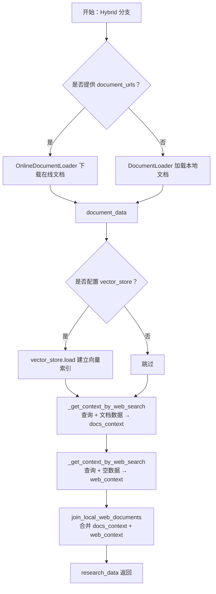
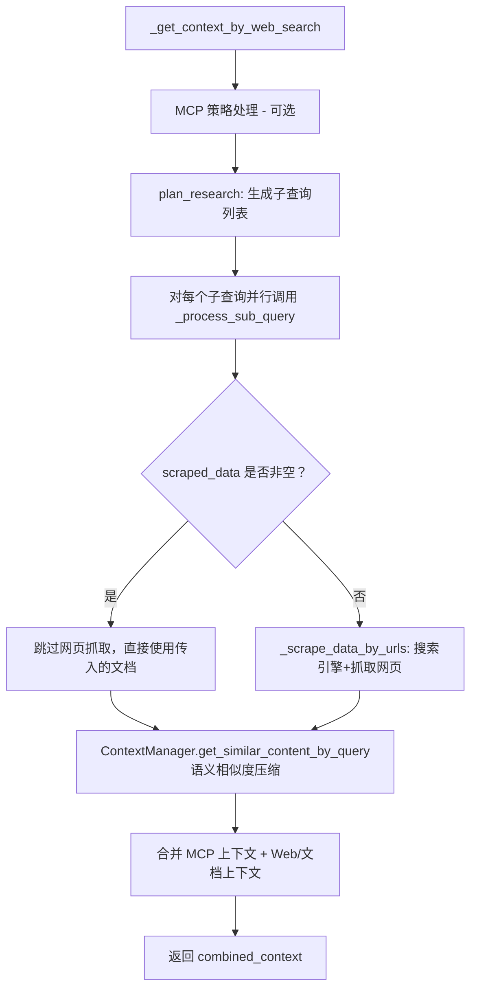

# GPT-Researcher 混合检索（Hybrid）流程分析

> **对应代码入口**：`gpt_researcher/skills/researcher.py` L161-L170  
> **触发条件**：`self.researcher.report_source == ReportSource.Hybrid.value`（即 `"hybrid"`）

---

## 一、整体流程概览

混合检索模式将 **本地/在线文档** 与 **Web 搜索** 两路信息源并行获取，最终通过 `join_local_web_documents` 合并为一段完整的研究上下文。



---

## 二、入口代码解读

```python
# researcher.py L161-L170
elif self.researcher.report_source == ReportSource.Hybrid.value:
    # 步骤1：加载文档数据
    if self.researcher.document_urls:
        document_data = await OnlineDocumentLoader(self.researcher.document_urls).load()
    else:
        document_data = await DocumentLoader(self.researcher.cfg.doc_path).load()

    # 步骤2：可选 - 将文档灌入向量存储
    if self.researcher.vector_store:
        self.researcher.vector_store.load(document_data)

    # 步骤3：基于文档的上下文检索（文档内搜索）
    docs_context = await self._get_context_by_web_search(
        self.researcher.query, document_data, self.researcher.query_domains
    )

    # 步骤4：纯 Web 搜索（传入空文档列表）
    web_context = await self._get_context_by_web_search(
        self.researcher.query, [], self.researcher.query_domains
    )

    # 步骤5：合并两路上下文
    research_data = self.researcher.prompt_family.join_local_web_documents(
        docs_context, web_context
    )
```

---

## 三、各步骤详细分析

### 3.1 文档加载

#### 路径 A：在线文档 — `OnlineDocumentLoader`

- **文件**：`gpt_researcher/document/online_document.py`
- **流程**：
  1. 遍历 `document_urls`，逐个通过 `aiohttp` HTTP GET 下载到临时文件
  2. 根据 URL 扩展名（.pdf / .txt / .docx / .csv / .xlsx / .md 等）选择对应的 LangChain Loader 解析
  3. 解析后删除临时文件
  4. 返回 `[{"raw_content": "...", "url": "..."}]` 格式的文档列表
- **支持格式**：pdf、txt、doc、docx、pptx、csv、xls、xlsx、md

#### 路径 B：本地文档 — `DocumentLoader`

- **文件**：`gpt_researcher/document/document.py`
- **流程**：
  1. 接受路径参数（单个目录 或 文件列表）
  2. 若为目录，递归遍历所有文件
  3. 根据文件扩展名选择 LangChain Loader 加载
  4. 返回 `[{"raw_content": "...", "url": "文件名"}]`
- **额外支持**：html、htm 格式（使用 `BSHTMLLoader`）

### 3.2 向量存储（可选）

```python
if self.researcher.vector_store:
    self.researcher.vector_store.load(document_data)
```

- 当配置了 `vector_store` 时，将加载的文档数据灌入向量索引
- 用于后续可能的向量相似度检索增强

### 3.3 文档上下文检索 — `_get_context_by_web_search(query, document_data, ...)`

> **关键点**：虽然方法名叫 `_get_context_by_web_search`，但当传入非空 `scraped_data`（即 `document_data`）时，不会执行网页抓取，而是直接对已有文档做语义相似度匹配。

**内部流程**：



1. **子查询生成**（`plan_research`）：
   - 先用检索器做初步搜索获取背景信息
   - 然后通过 LLM 规划出多个子查询（最多 `max_iterations` 个）
   - 若非子主题报告，还会将原始查询加入列表

2. **并行处理子查询**（`_process_sub_query`）：
   - 当 `scraped_data` 非空时（文档上下文路径），直接将文档数据作为搜索面
   - 当 `scraped_data` 为空时（Web 路径），通过配置的 Retriever 搜索并抓取网页内容
   - MCP 检索器有独立的缓存策略（fast/deep/disabled）

3. **语义相似度过滤**（`ContextManager.get_similar_content_by_query`）：
   - 使用 `ContextCompressor` 对文档/网页进行向量嵌入
   - 按查询相似度排序，返回最相关的 top-10 内容片段
   - 使用 LLM 进行上下文压缩/摘要

### 3.4 Web 上下文检索 — `_get_context_by_web_search(query, [], ...)`

- 传入空列表 `[]` 作为 `scraped_data`
- 此时 `_process_sub_query` 内部会执行 `_scrape_data_by_urls`：
  1. 调用所有非 MCP 检索器（如 Tavily、Bing、Google 等）搜索子查询
  2. 收集搜索结果中的 URL
  3. 通过 `scraper_manager.browse_urls` 抓取网页内容
  4. 再通过 `ContextCompressor` 进行语义过滤和压缩

### 3.5 上下文合并 — `join_local_web_documents`

**默认实现**（`PromptFamily`）：

```python
@staticmethod
def join_local_web_documents(docs_context: str, web_context: str) -> str:
    return f"Context from local documents: {docs_context}\n\nContext from web sources: {web_context}"
```

简单地将两路上下文用标签区分后拼接。不同的 PromptFamily 实现有不同的格式化方式：

| PromptFamily            | 合并方式                                                                       |
| ----------------------- | ------------------------------------------------------------------------------ |
| `PromptFamily`（默认）  | 添加 "Context from local documents:" / "Context from web sources:" 前缀拼接    |
| `Granite3PromptFamily`  | 使用 Granite 特殊标签 `<\|start_of_role\|>documents...` 包裹，去重前后缀后合并 |
| `Granite33PromptFamily` | 简单 `\n\n` 拼接两路上下文                                                     |

---

## 四、与其他检索模式的对比

| 特性           | Local          | Web          | Hybrid                        |
| -------------- | -------------- | ------------ | ----------------------------- |
| 文档加载       | ✅ 本地文件    | ❌           | ✅ 本地/在线文档              |
| Web 搜索       | ❌             | ✅           | ✅                            |
| 两路上下文合并 | ❌             | ❌           | ✅ `join_local_web_documents` |
| 向量存储加载   | ✅             | ❌           | ✅                            |
| 搜索引擎使用   | 文档内语义搜索 | 外部搜索引擎 | 两者均有                      |

---

## 五、关键配置参数

| 参数                           | 来源                       | 说明                                          |
| ------------------------------ | -------------------------- | --------------------------------------------- |
| `report_source`                | 用户输入 / 配置            | 必须设为 `"hybrid"`                           |
| `document_urls`                | `researcher.document_urls` | 在线文档 URL 列表，优先于本地路径             |
| `doc_path`                     | `researcher.cfg.doc_path`  | 本地文档目录路径（无 `document_urls` 时使用） |
| `vector_store`                 | `researcher.vector_store`  | 可选的向量存储实例                            |
| `query_domains`                | `researcher.query_domains` | 限制搜索域名                                  |
| `max_search_results_per_query` | `researcher.cfg`           | 每个子查询的最大搜索结果数                    |
| `mcp_strategy`                 | `researcher.cfg` / 实例级  | MCP 策略：fast / deep / disabled              |

---

## 六、数据流总结

```
用户查询 (query)
    │
    ├─── 文档路径 ──→ 加载文档 ──→ 子查询规划 ──→ 语义匹配 ──→ docs_context
    │                                                              │
    └─── Web 搜索 ──→ 子查询规划 ──→ 搜索+抓取 ──→ 语义匹配 ──→ web_context
                                                                   │
                                              join_local_web_documents
                                                        │
                                                  research_data
                                                        │
                                               后续报告生成使用
```

> **核心设计思想**：Hybrid 模式通过将文档知识（内部/专有数据）与实时网络信息互补，既保证了专有领域的准确性，又能获取最新的公开信息，从而生成更全面、更有深度的研究报告。
